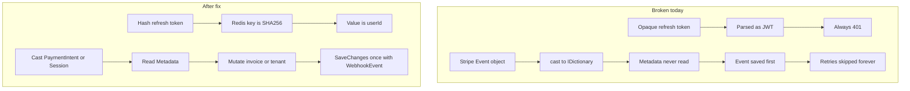

# Fix OpenCode Ledgerly Review Findings

The skeleton (Clean Architecture, JWT `tid`, BCrypt) stays. Work proceeds in layers so security holes close first, then broken money/auth flows, then tests that would have caught them.

## 1. Close the open webhook hole

- Default [`Dev:EnableWebhookSimulator`](src/Ledgerly.Api/appsettings.json) to `false`.
- In [`DevWebhookController`](src/Ledgerly.Api/Controllers/DevWebhookController.cs): return 404 unless **both** `IsDevelopment()` **and** the flag are true.
- Do not register the controller in non-Development (or keep the 404 guard as defense in depth).

## 2. Fix refresh/logout (opaque tokens)

Today [`RefreshHandler`](src/Ledgerly.Application/Auth/RefreshHandler.cs) calls `GetUserIdFromExpiredToken(request.RefreshToken)` on a random base64 string. That cannot work.

Change [`IRefreshTokenStore`](src/Ledgerly.Application/Abstractions/IServices.cs) to token-keyed storage:

- Redis key: `refresh:{sha256(token)}`
- Value: `userId`
- TTL unchanged

API:

- `SaveAsync(userId, token, expiresAt)`
- `TryGetUserIdAsync(token) -> Guid?`
- `RevokeAsync(token)`

Then:

- [`RefreshHandler`](src/Ledgerly.Application/Auth/RefreshHandler.cs): look up user from the opaque token, rotate (revoke old, save new). Remove the JWT parse.
- [`LogoutHandler`](src/Ledgerly.Application/Auth/LogoutHandler.cs): revoke by refresh token alone (works after access token expiry).
- Drop `GetUserIdFromExpiredToken` from [`IJwtTokenService`](src/Ledgerly.Application/Abstractions/IServices.cs) / [`JwtTokenService`](src/Ledgerly.Infrastructure/Security/JwtTokenService.cs).
- [`AuthController`](src/Ledgerly.Api/Controllers/AuthController.cs): `[Authorize]` on `Me`; leave `refresh`/`logout` anonymous (they only need the refresh token).
- Frontend [`App.tsx`](frontend/src/App.tsx): call `/api/auth/logout` with the refresh token before clearing `localStorage`. Add a one-shot 401 retry via refresh in [`api.ts`](frontend/src/api.ts).

## 3. Make Stripe webhooks actually settle money and plans

**Extract typed objects** in [`StripeWebhookController`](src/Ledgerly.Api/Controllers/StripeWebhookController.cs):

- `PaymentIntent` → `invoiceId` / `tenantId` from `Metadata`
- `Session` → `tenantId`, `CustomerId`, `SubscriptionId`, `plan` from `Metadata`

**Process then persist, one `SaveChanges`:** in [`StripeWebhookHandler`](src/Ledgerly.Application/Billing/StripeWebhookHandler.cs) insert `WebhookEvent` + mutate tenant/invoice, then save once. Unique index on `StripeEventId` still makes duplicates a no-op (catch and return 200). If processing throws, the insert rolls back and Stripe can retry.

**Checkout must write the data the webhook needs** in [`StripeGateway`](src/Ledgerly.Infrastructure/Stripe/StripeGateway.cs) / [`CheckoutHandler`](src/Ledgerly.Application/Billing/BillingHandlers.cs):

- Allowlist `PriceId` against `Stripe:PricePro` / `Stripe:PriceBusiness`
- Put `tenantId` and `plan` (`pro`/`business`) in session metadata
- On `checkout.session.completed`: set `Plan`, `PlanStatus = Active`, `StripeCustomerId`, `StripeSubscriptionId`
- On `customer.subscription.deleted`: `PlanStatus = Canceled` (keep last plan for history)
- Payment amount: `decimal.Round(total * 100m, 0, MidpointRounding.AwayFromZero)` instead of truncating cast

Add `GetByIdAnyTenantAsync` on invoice/tenant repos (explicit `IgnoreQueryFilters`) for webhook use only.

## 4. Invoice state machine

Put transitions on [`Invoice`](src/Ledgerly.Domain/Entities/Invoice.cs) (or a small domain helper) and use them from handlers:

| From | Action | To |
|---|---|---|
| Draft | Send | Sent |
| Draft, Sent | Void | Void |
| Sent | Pay (webhook / public pay) | Paid |
| Paid | Send / Void / Pay | reject `invalid_state` |
| Void | anything | reject |
| Draft | Public pay | reject |

Also:

- [`UpdateInvoiceHandler`](src/Ledgerly.Application/Invoices/InvoiceHandlers.cs): require at least one line; call `RecalculateTotals()` after `ClearLines()`.
- [`DeleteClientHandler`](src/Ledgerly.Application/Clients/ClientHandlers.cs): if the client has invoices, return `conflict` (FK is `Restrict` today → uncaught 500).
- Overdue: when mapping to DTO, if status is `Sent` and `DueDate < UtcNow`, expose `Overdue` (no Hangfire). Remove unused Hangfire package refs from [`Ledgerly.Api.csproj`](src/Ledgerly.Api/Ledgerly.Api.csproj).

## 5. Tenant isolation without the Guid.Empty landmine

In [`AppDbContext`](src/Ledgerly.Infrastructure/Persistence/AppDbContext.cs) change filters to:

`TenantId == _current.TenantId`

Remove `|| _current.TenantId == Guid.Empty`.

In [`TenantMiddleware`](src/Ledgerly.Api/Middleware/TenantMiddleware.cs) delete the `Query["tenantId"]` fallback. Tenant comes only from the JWT `tid` claim.

Webhook/public-token paths already use `IgnoreQueryFilters` or will use `GetByIdAnyTenantAsync`.

Add a unique index on `Users.Email` (global), matching `EmailExistsAsync`. New EF migration.

## 6. Concurrency: plan limit and invoice numbers

In [`CreateInvoiceHandler`](src/Ledgerly.Application/Invoices/CreateInvoiceHandler.cs), wrap in a DB transaction and `SELECT ... FOR UPDATE` the tenant row (add `LockByIdAsync` on [`ITenantRepository`](src/Ledgerly.Application/Abstractions/IRepositories.cs)):

1. Lock tenant
2. Count invoices this month
3. Enforce Free limit (3)
4. Allocate next `INV-{year}-{seq}`
5. Insert + commit

Map unique-index conflicts on `(TenantId, Number)` to 409 instead of 500.

## 7. Hardening (medium findings)

- **JWT:** remove the committed key from [`appsettings.json`](src/Ledgerly.Api/appsettings.json) and the hardcoded fallback in [`Program.cs`](src/Ledgerly.Api/Program.cs). Keep a dev-only key in [`appsettings.Development.json`](src/Ledgerly.Api/appsettings.Development.json). [`docker-compose.yml`](docker-compose.yml) must require `JWT_KEY` (no weak default). Generic `postgres/postgres` placeholder in base connection string (drop the machine username).
- **Roles:** `[Authorize(Roles = "Owner")]` on billing checkout/portal. Staff keeps clients/invoices.
- **Rate limit:** ASP.NET `AddRateLimiter` (fixed window) on `api/auth/login` and `register`.
- **Env gates in Program.cs:** Swagger + CORS policy `"Dev"` + `Database.Migrate()` only when `IsDevelopment()`.
- **Auth:** `[Authorize]` on `Me`. Validate email format + quantity/unit price `>= 0` on create/update invoice (use existing [`Guard`](src/Ledgerly.Shared/Guard.cs)).

## 8. Tests that lock the fixes in

Keep local Postgres/Redis for running the app. Tests must **not** call `Migrate()` on the developer DB.

**Unit (fakes / InMemory, already referenced):**

- Refresh: opaque token round-trip, reject garbage JWT-as-refresh
- Invoice transitions: send paid → fail; void paid → fail; pay draft → fail
- Webhook handler: typed metadata applies Paid + plan upgrade; duplicate event is no-op
- Query filter: `TenantId == Empty` no longer returns other tenants
- Plan limit after 3 invoices in month

**Integration (`WebApplicationFactory<Program>`):**

- Detect Testing env: skip `Migrate()`, use EF InMemory (or SQLite) + in-memory `IRefreshTokenStore`, stub `IStripeGateway`
- Register/login/refresh/logout/me
- Two tenants: cross-tenant GET → 404
- 4th Free invoice → 402 `plan_limit`
- Stripe webhook with bad signature → 400
- Dev simulator → 404 when flag off

Replace the current health-only test that boots the real database.

## Implementation order

1. Webhook simulator off + JWT/config hardening (safe to ship immediately)
2. Refresh store + auth controller/frontend
3. Query filters + tenant middleware + email unique migration
4. Stripe typed webhook + checkout metadata + plan fields
5. Invoice state machine + client delete + totals
6. Tenant row lock for create-invoice
7. Rate limit, roles, Swagger/CORS/Migrate gates
8. Tests last so they assert the new contracts
